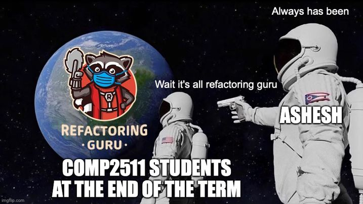

# Tutorial 08

## Project Check-Ins
- Most marking will be offline.
    - Will try to run the frontend and test coverage.
    - If you have any questions/concerns about milestone 2, tell me.
- Ask me any questions you like!
- Ask for feedback on milestone 1!


## Marking of Milestone 1
- Marks better than assignment.
- Contributions will be scaled (if there is a significant different in contributions) at the end of the course.
- Submit with tag!!!!
- Epics needed a user story.

```
$ git tag -fa submission -m "milestone3-submission"
$ git push -f origin "milestone3-submission"
```


## Milestone 3

A summary of changes:
https://gitlab.cse.unsw.edu.au/COMP2511/21T2/project-specification/-/commit/7db655080cce5fbc497977c1b1a4c253b602eecf?expanded=1

The following requirements have been added to the applicable sections in this specification document:
* Bosses
* DoggieCoin
* Additional rare items
* An additional "confusing mode"
* A goal type of killing all bosses

- Less work than milestone 2.
    - You can implement anything you didn't have time to do in milestone 2.
- Difficulty depends greatly on your design.
- No marked lab next week!!!


## A. Generic Programming (30 minutes)

### Part 1 - Implementation


[Design Pattern](https://refactoring.guru/design-patterns/iterator)



Inside `src/stack`, there are a series of stubs for a `Stack` class which takes in a generic type. There are a series of tests inside `StackTest.java` which currently fail. 

Iterator is a design pattern baked into the Java language.

```java
Iterator iter = tree.iterator();
while (iter.hasNext()) {
    E item = iter.next();
}
```

[Iterator](https://docs.oracle.com/en/java/javase/11/docs/api/java.base/java/util/Iterator.html)

[Iterable](https://docs.oracle.com/en/java/javase/11/docs/api/java.base/java/lang/Iterable.html)

[List](https://docs.oracle.com/en/java/javase/11/docs/api/java.base/java/util/List.html)

Implement the methods so that the tests pass, using an `ArrayList` to store the internal data structure. Answer the following questions:

1. What is `E`? 

Generic type


2. What is the `Iterable` interface? Why does it have an `E` as well? What methods does it force us to implement?

Iterable - something that can be iterated over.
Parameterised as .next() it will return elements of type E
Forces us to implement the .iterator() method.


3. When completing `toArrayList`, why do we need to make a copy rather than just returning our internal ArrayList?

We don't want to break encapsulation by giving the keys to our ArrayList


4. What does the `.iterator()` method allow us to do? Discuss the test inside `StackTest.java`.

`.iterator()` allows us to loop through it like a normal collection


### Part 2 - Utility Functions & Iterators

Inside `Stack.java`, add the following static utility functions:

```java
public static Integer sumStack(Stack<? extends Integer> stack);
```

5. What does the `<? extends Type>` and `<? super Type>` mean?

extends - the parameterised type must be a class or **subclass** of the given type.
super - the parameterised type must be a class or **superclass** of the given type.


6. How could we change our class definition to restrict the parameterisation?

```java
public static void prettyPrint(Stack<?> stack);
```

Having pushed the words "hello", "how", "are", "you", "today" on, the following should be printed:

```
[today you are how hello]
```

See `src/stack/Stack.java`.

7. What is the difference between `?` and `E`?

`?` can't be referred to as a type, whereas `E` can (they perform a similar conceptual role).

8. We need to go through the stack and print out each element with a space, except for the last one (which doesn't have a space). There are a couple of ways to do this, but create an `Iterator` and use the `.next()` method to traverse the stack.

See `src/stack/Stack.java`.
